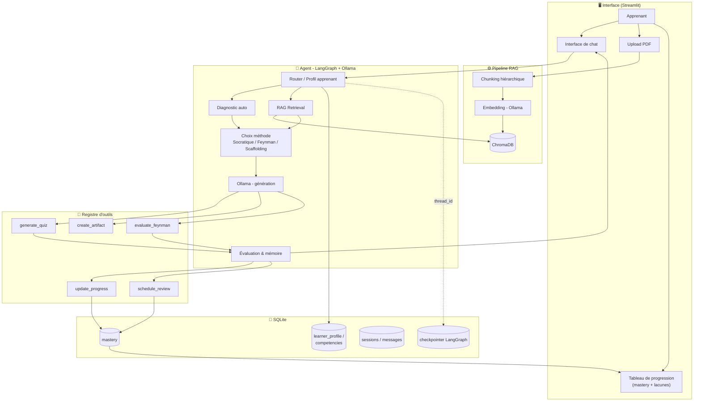
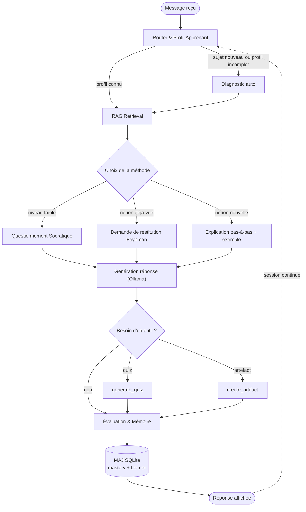
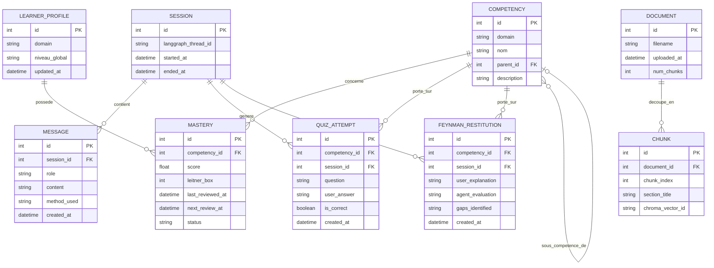
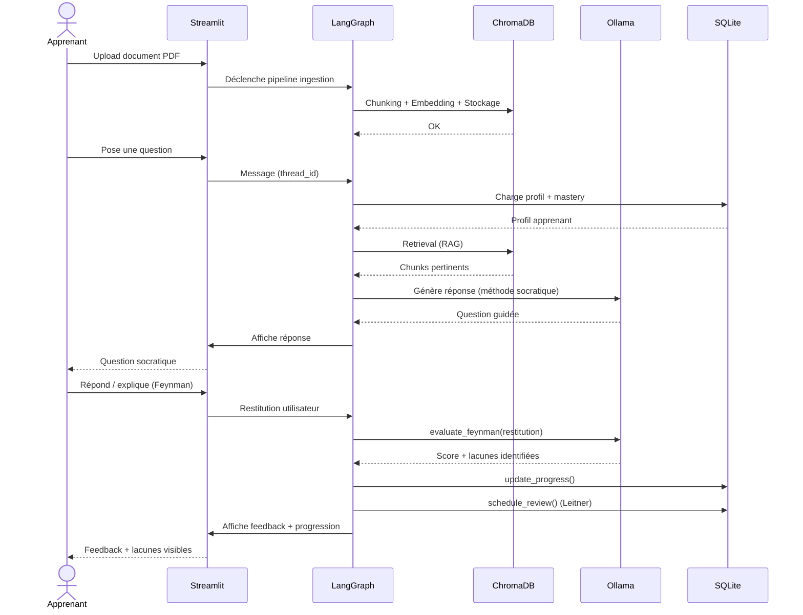

# Agent IA d'Apprentissage — Cahier des Charges Technique (V1)

*Document vivant — dernière mise à jour : 19 août 2026*
*Statut : V1 / MVP mono-utilisateur*

---

## 1. Vision

Un agent conversationnel local (LangGraph + Ollama), capable d'aider une personne à apprendre un domaine à partir de documents PDF qu'elle importe. L'agent ne se contente pas de répondre : il applique une méthodologie pédagogique active (questionnement socratique, restitution façon Feynman), diagnostique lui-même le niveau de l'utilisateur, et rend la progression **visible et interactive**, lacunes comprises.

> *"What I cannot create, I do not understand."* — Richard Feynman
> C'est le principe central de l'agent : l'utilisateur ne "reçoit" pas la connaissance, il doit la reconstruire et l'expliquer pour qu'elle soit validée comme acquise.

## 2. Portée du projet (V1)

### Inclus dans la V1

- Agent mono-utilisateur, exécution 100% locale (Ollama).
- Import de documents **PDF uniquement**.
- Méthodes pédagogiques : questionnement Socratique, restitution Feynman, diagnostic automatique du niveau, répétition espacée (Leitner).
- Outils de l'agent : génération de quiz interactifs, création d'artefacts pédagogiques (schémas, exercices), évaluation de restitution.
- Tableau de bord interactif de progression (compétences maîtrisées / lacunes).
- Persistance via **SQLite** (profil, compétences, historique, checkpointer LangGraph).

### Explicitement hors-scope V1 (à ne pas construire maintenant)

- Multi-utilisateur / authentification.
- Fallback vers un LLM cloud.
- Ingestion d'autres formats (PPTX, audio/vidéo, Whisper).
- Outils calendrier et recherche web.
- Lien avec le pipeline de fine-tuning — **projet séparé, ne pas coupler l'architecture.**

### Domaine d'apprentissage

Le domaine n'est volontairement **pas figé dans le code** : il est traité comme une donnée (un `domain` en base + les PDF importés), pas comme une hypothèse d'architecture. Tu m'as dit vouloir démarrer sur "un domaine un peu simple" sans le nommer — je te propose donc une architecture domaine-agnostique, et tu choisis le premier corpus PDF à uploader le moment venu (ça peut être n'importe quoi : un chapitre de cours, un sujet grand public, etc.). Voir section 12 pour ce point ouvert.

---

## 3. Méthodologie pédagogique

| Mécanisme | Rôle | Déclenchement |
|---|---|---|
| **Diagnostic automatique** | L'agent pose quelques questions calibrées en début de sujet pour estimer le niveau, sans questionnaire déclaratif | Premier contact sur une compétence, ou profil incomplet |
| **Questionnement Socratique** | L'agent guide par des questions plutôt que de donner la réponse directement | Niveau faible à moyen sur la compétence |
| **Restitution Feynman** | L'utilisateur explique la notion avec ses propres mots ; l'agent évalue et identifie les lacunes précises | Niveau déjà travaillé, ou fin d'un cycle d'explication |
| **Scaffolding** | Explication pas-à-pas avec exemples, quand la notion est totalement nouvelle | Notion jamais abordée |
| **Répétition espacée (Leitner)** | Reprogramme automatiquement une révision selon la performance | Après chaque évaluation (quiz ou restitution) |
| **Micro-objectifs hiérarchiques** | Le domaine est découpé en compétences (arbre parent/enfant), débloquées progressivement | Structure de fond du modèle de données |

La mesure de progression n'est **pas un simple score global** : chaque compétence a son propre niveau de maîtrise, ce qui permet le tableau de bord "progrès + lacunes" que tu as demandé (détail section 8).

---

## 4. Architecture technique



### Description des couches

1. **Interface (Streamlit)** — upload de PDF, chat, et surtout le tableau de bord de progression (le point que tu as insisté à rendre interactif).
2. **Pipeline RAG** — chunking hiérarchique (par section/chapitre, comme discuté précédemment) → embedding via un modèle Ollama dédié (ex. `nomic-embed-text`) → stockage vectoriel ChromaDB.
3. **Agent (StateGraph LangGraph)** — le cœur décisionnel, détaillé section 5.
4. **Registre d'outils** — les capacités actives de l'agent (quiz, artefacts, évaluation, progression).
5. **SQLite** — une base unique pour : le profil, les compétences, l'historique de session, **et** le checkpointer natif de LangGraph (`SqliteSaver`), qui peut vivre dans le même fichier `.db` ou un fichier séparé — recommandation : fichier séparé (`checkpoints.db`) pour ne pas mélanger le schéma applicatif avec les tables internes de LangGraph.

---

## 5. StateGraph de l'agent (LangGraph)



### Détail des nœuds

| Nœud | Rôle | Lecture | Écriture |
|---|---|---|---|
| `router_profil` | Charge le profil apprenant, détermine la compétence active | `learner_profile`, `competencies` | — |
| `diagnostic` | Pose 2-3 questions calibrées si le profil est incomplet sur ce sujet | — | `mastery` (estimation initiale) |
| `rag_retrieval` | Récupère les passages pertinents des PDF importés | ChromaDB | — |
| `method_selection` | Choisit Socratique / Feynman / Scaffolding selon `mastery.score` | `mastery` | — |
| `generate_response` | Appelle Ollama avec le contexte RAG + la méthode choisie | — | — |
| `tool_execution` | Déclenche `generate_quiz` / `create_artifact` si le LLM le juge utile | — | selon l'outil |
| `evaluation_memory` | Traite la réponse au quiz ou la restitution, calcule le score | — | `mastery`, `quiz_attempts`, `feynman_restitutions` |

**Décision de design — Human-in-the-loop :** dans le schéma initial, le HITL validait chaque action de l'agent. Pour cette V1, les seules actions possibles sont pédagogiques et à faible risque (quiz, artefact, texte) — **je ne mets donc pas de validation humaine bloquante par défaut.** Je garde un point d'interruption LangGraph (`interrupt_before`) prêt à activer sur le nœud `tool_execution`, à réactiver facilement si tu ajoutes plus tard un outil à risque (ex. calendrier). Dis-moi si tu préfères l'inverse (validation systématique dès la V1).

---

## 6. Modèle de données (SQLite)



**Notes :**
- `COMPETENCY` est auto-référencée (`parent_id`) pour représenter les micro-objectifs hiérarchiques du domaine (module → sous-module).
- `MASTERY.leitner_box` et `next_review_at` pilotent la répétition espacée.
- Les embeddings eux-mêmes vivent dans **ChromaDB**, pas en SQLite — `CHUNK.chroma_vector_id` fait juste le lien.
- Le schéma est volontairement mono-utilisateur (pas de `user_id`) pour rester simple — facile à étendre plus tard si besoin (ajout d'une FK `user_id` sur `learner_profile` et `session`).

---

## 7. Registre d'outils

| Outil | Déclencheur | Entrée | Sortie | Effet de bord |
|---|---|---|---|---|
| `rag_search` | Besoin de contexte sur un sujet | `query`, `top_k` | Chunks pertinents | Aucun (lecture seule) |
| `generate_quiz` | Compétence jugée prête à être testée, ou demande explicite | `competency_id`, `nb_questions`, `difficulte` | Quiz structuré (JSON) | Écrit dans `quiz_attempts` après réponse |
| `evaluate_feynman` | L'utilisateur fournit une explication | `competency_id`, texte utilisateur | Score + lacunes identifiées | Écrit `feynman_restitutions`, met à jour `mastery` |
| `create_artifact` | L'agent juge qu'un support visuel aiderait | `type` (schéma / exercice / carte mentale), contenu | Composant HTML/Markdown interactif affiché dans Streamlit | Aucun (affichage seul) |
| `update_progress` | Après quiz ou restitution | `competency_id`, delta | — | Met à jour `mastery.score` |
| `schedule_review` | Après évaluation | `competency_id`, résultat | Prochaine date de révision | Met à jour `mastery.next_review_at`, `leitner_box` |

---

## 8. Interface & tableau de progression

C'est le point que tu as le plus insisté à préciser : la mesure doit être **interactive** et montrer à la fois le progrès et les lacunes. Concrètement, côté Streamlit :

- Une vue par compétence : barre de maîtrise colorée (vert ≥ 80%, orange 40-80%, rouge < 40% ou en retard de révision).
- Une liste "Lacunes actives" = compétences sous le seuil ou dont `next_review_at` est dépassé.
- Un historique cliquable : chaque tentative de quiz / restitution Feynman reste consultable (traçabilité de la progression dans le temps).
- Graphique (via `plotly` ou `altair`, natif Streamlit) : évolution du score global du domaine dans le temps.

---

## 9. Flux d'interaction type



---

## 10. Cas d'utilisation (UML)

Diagramme complet fourni en fichier séparé : **`agent_apprentissage_use_case.drawio`** (ouvrable dans [diagrams.net](https://app.diagrams.net) ou l'extension VS Code Draw.io).

**Acteurs :**
- **Apprenant** (principal) — déclenche la quasi-totalité des cas d'usage.
- **Ollama (LLM local)** (secondaire, système externe) — associé aux cas d'usage nécessitant une génération.

**Cas d'utilisation principaux :**
1. Uploader un document PDF
2. Discuter avec l'agent (Q&R guidée)
3. Passer un diagnostic de niveau *(`<<extend>>` de #2, déclenché conditionnellement)*
4. Répondre à un quiz interactif
5. Faire une restitution (Feynman)
6. Consulter sa progression et ses lacunes
7. Recevoir un rappel de révision (spaced repetition)
8. Générer un artefact pédagogique *(`<<extend>>` de #2, déclenché à la discrétion de l'agent)*

---

## 11. Stack technique récapitulative

| Composant | Technologie | Rôle |
|---|---|---|
| Orchestration agent | LangGraph | StateGraph, checkpointer, conditional edges |
| LLM | Ollama (local) | Génération, évaluation Feynman |
| Embeddings | Ollama (`nomic-embed-text` ou équivalent) | Vectorisation des chunks |
| Vector store | ChromaDB | Stockage et recherche vectorielle |
| Persistance applicative | SQLite | Profil, compétences, mastery, historique |
| Checkpointer | LangGraph `SqliteSaver` | État de conversation, reprise de session |
| Interface | Streamlit | Chat, upload, tableau de progression |
| Parsing PDF | `pypdf` / `unstructured` | Extraction texte + structure (sections) pour le chunking hiérarchique |

**Remarque sur le choix du modèle Ollama :** le raisonnement socratique multi-tours et l'évaluation de restitution Feynman sont des tâches exigeantes pour un LLM local. Des modèles comme `llama3.1:8b-instruct`, `qwen2.5:7b-instruct` ou `mistral-nemo` sont de bons points de départ — le choix final dépendra de ta config matérielle (RAM/VRAM disponible), dis-moi si tu veux qu'on affine ce choix.

---

## 12. Hypothèses & points ouverts

Ces points ont été tranchés par défaut pour ne pas bloquer le démarrage — à confirmer ou corriger :

1. **Domaine du premier corpus** : non figé dans l'architecture (voir section 2). Tu choisiras le PDF de test.
2. **Human-in-the-loop non bloquant en V1** (section 5) — à confirmer.
3. **Modèle Ollama** : pas encore choisi précisément, dépend de ta machine.
4. **Structure du diagnostic auto** : nombre de questions et granularité non encore définis — à affiner une fois le domaine choisi.
5. **Format de sortie des artefacts** : HTML/Markdown rendu via `st.components.v1.html()` — à valider si tu préfères un autre rendu (ex. Mermaid inline, SVG).

---

## 13. Angles morts / risques à surveiller

- **Fiabilité de l'auto-évaluation Feynman** : un LLM local peut se tromper en notant une restitution (faux positifs/négatifs). Recommandation : ajouter une rubrique de notation explicite dans le prompt (critères précis) plutôt qu'un jugement libre, pour limiter la dérive.
- **Diagnostic initial sans supervision** : si le diagnostic auto est mal calibré dès le départ, toute la suite (Leitner, méthode choisie) hérite du biais. Prévoir une possibilité de correction manuelle du niveau depuis le tableau de bord.
- **Contexte long** : sur des sessions longues, l'historique de conversation peut dépasser la fenêtre de contexte d'un modèle local plus petit — prévoir un nœud de résumé (`summarize`) si ça devient un problème en pratique.
- **Qualité du chunking PDF** : les PDF mal structurés (pas de vraies sections, mise en page complexe) dégradent le chunking hiérarchique — prévoir un fallback en chunking par taille fixe si aucune structure n'est détectée.
- **Un seul type de source (PDF)** : limite volontaire en V1, mais à garder en tête si le domaine choisi est mal couvert par tes PDF disponibles.

---

## 14. Roadmap (V2 et au-delà)

- Fallback vers un LLM cloud pour les tâches complexes.
- Ingestion multi-format (PPTX, audio/vidéo via Whisper).
- Outils supplémentaires : calendrier, recherche web.
- Multi-utilisateur (si le projet évolue vers un usage partagé).
- Réévaluer un éventuel lien avec le pipeline de fine-tuning par domaine — **uniquement si ça devient pertinent, projet séparé pour l'instant.**

---

## 15. Structure de projet suggérée

```
agent_apprentissage/
├── app.py                    # Interface Streamlit
├── graph/
│   ├── state.py               # État LangGraph (TypedDict)
│   ├── nodes.py                # router, diagnostic, retrieval, method, generate, eval
│   └── graph.py                # Construction du StateGraph
├── tools/
│   ├── quiz.py
│   ├── artifact.py
│   ├── feynman.py
│   └── progress.py
├── rag/
│   ├── ingestion.py            # Chunking hiérarchique + embedding
│   └── retriever.py
├── db/
│   ├── schema.sql
│   └── db.py                   # Connexion SQLite + requêtes
├── data/
│   ├── documents/               # PDF uploadés
│   └── chroma/                  # Persistance ChromaDB
├── checkpoints.db              # SqliteSaver (LangGraph)
└── requirements.txt
```

---

## 16. Prochaines étapes concrètes

1. Choisir le premier domaine/PDF de test (même simple, pour valider le pipeline de bout en bout).
2. Installer Ollama + tirer un modèle de génération et un modèle d'embedding.
3. Écrire `db/schema.sql` à partir du diagramme ERD (section 6) et l'initialiser.
4. Construire le StateGraph avec des nœuds "squelette" (retours statiques) pour valider le graphe avant de brancher le LLM.
5. Brancher le pipeline RAG (chunking → embedding → ChromaDB) sur un PDF réel.
6. Implémenter `generate_quiz` et `evaluate_feynman` en premier (ce sont les outils qui ferment la boucle progression/lacunes).
7. Construire le tableau de bord Streamlit une fois que `mastery` contient de vraies données.
